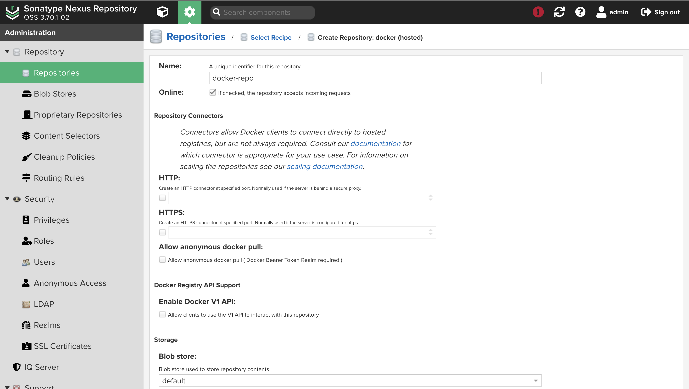
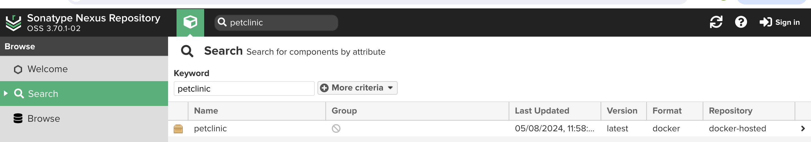
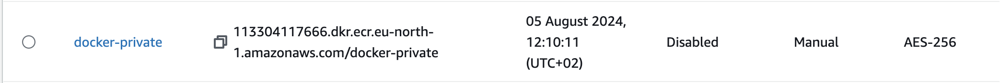
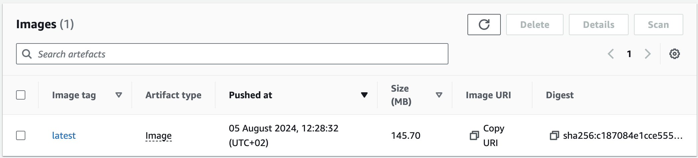
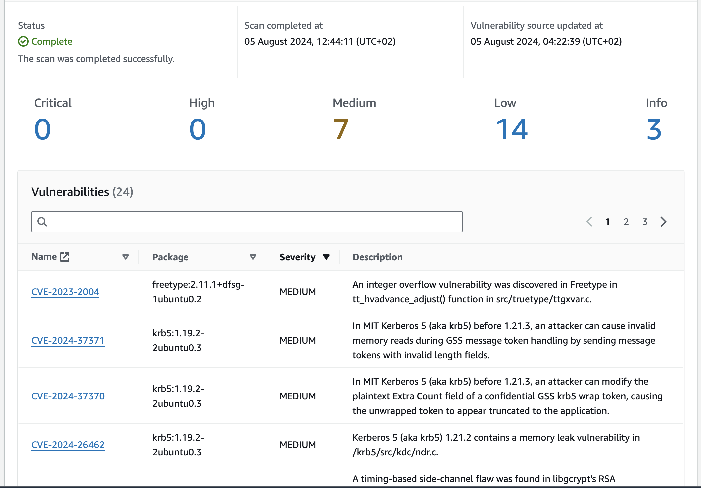

# Task 2

## Uploading spring-petclinic docker image to Nexus Repository

### Step 1: Creating docker repository in Nexus Repository Manager



### Step 2: Pushing docker image to Nexus Repository Manager

```bash
docker build -t 127.0.0.1:8083/petclinic:latest .
docker login 127.0.0.1:8083
docker push 127.0.0.1:8083/petclinic
```



### Step 3: Create ECR repository



### Step 4: Pushing docker image to ECR

```bash
docker tag spring-petclinic:latest <aws_account_id>.dkr.ecr.eu-north-1.amazonaws.com/spring-petclinic:latest
docker push <aws_account_id>.dkr.ecr.eu-north-1.amazonaws.com/spring-petclinic:latest
```



### Step 5: Vurnerability scan on ECR



No high severity or critical vurnerabilities found. 


